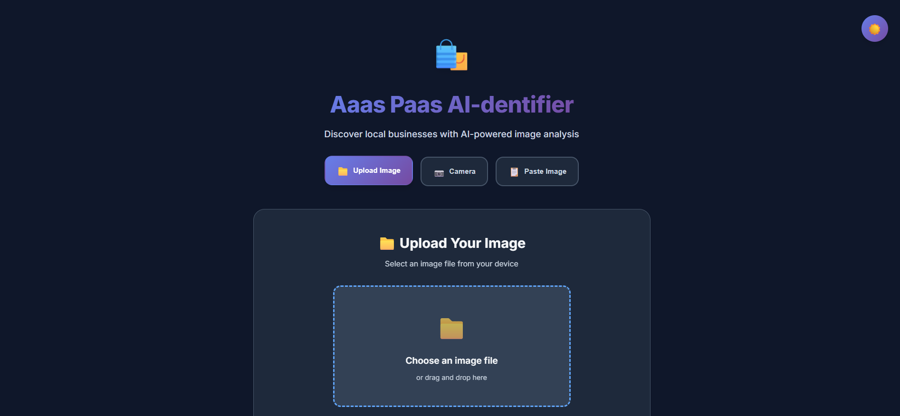
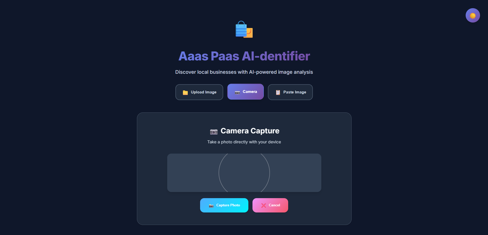
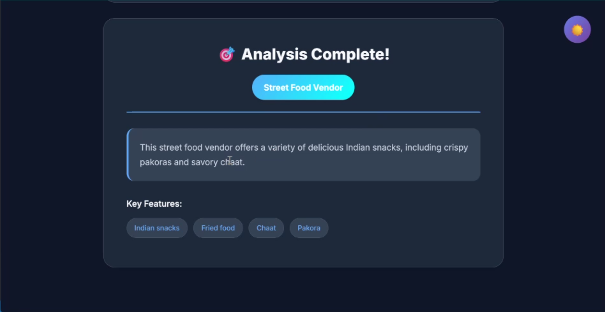

# 🌐 Aaas Paas AI-dentifier

> A full-stack AI-powered application that identifies and analyzes images of local businesses and surroundings using **Google Gemini Vision API**.

This project consists of:
- **Backend**: Spring Boot (Java) REST API
- **Frontend**: React-based web interface

---

## ✨ Features

### 🖼 Multiple Image Input Methods
- **File Upload** – Select an image from your device.
- **Camera Capture** – Take photos in real-time via device camera.
- **Paste from Clipboard** – Paste copied images directly.

### 🎯 AI Image Recognition
- Powered by **Google Gemini Vision API**
- Detects **business type** and environment details
- Generates **detailed descriptions** and **smart tags**

### ⚙️ Full-Stack Integration
- **Backend**: Java Spring Boot REST API for image analysis requests
- **Frontend**: React app with modern UI/UX

---

## 📸 Screenshots

| Home Page | Camera Mode | Analysis Results |
|-----------|-------------|------------------|
|  |  |  |

---

## 🎥 Demo Video
*(Add your demo video link here)*  
[](screenshots/demo-video.gif)

---

## 🛠 Tech Stack

### **Frontend**
- React 18+
- Axios (API calls)
- HTML5 Canvas API (image processing)
- Camera & Clipboard API

### **Backend**
- Java 17+
- Spring Boot
- REST API endpoints
- Maven build system

---

## 🚀 Getting Started

### 1️⃣ Clone the repository
```bash
git clone https://github.com/ankitkrshah30/DataDrifters
cd DataDrifters
```

### 2️⃣ Backend Setup
```bash
cd backend
mvn clean install
mvn spring-boot:run
```
Backend will run at: `http://localhost:8080`

### 3️⃣ Frontend Setup
```bash
cd frontend
npm install
npm start
```
Frontend will run at: `http://localhost:3000`

---

## 📂 Project Structure
```
aas-paas/
│── backend/           # Spring Boot REST API
│   ├── src/           # Java source files
│   ├── pom.xml        # Maven dependencies
│
│── frontend/          # React web app
│   ├── public/        # Static files
│   ├── src/           # React components
│   ├── package.json   # Node dependencies
```

---

## 🔐 Permissions
- Camera access is required for capturing images
- Clipboard access for paste functionality

---

## 📜 License
This project is licensed under the MIT License.

---

## 👨‍💻 Author
Made with ❤️ by 
- Ankit Kumar Shah - https://github.com/ankitkrshah30
- Aharnish Dubey - https://github.com/aharnish5
- Aryaman Bhardwaj - https://github.com/CaptnErlking
